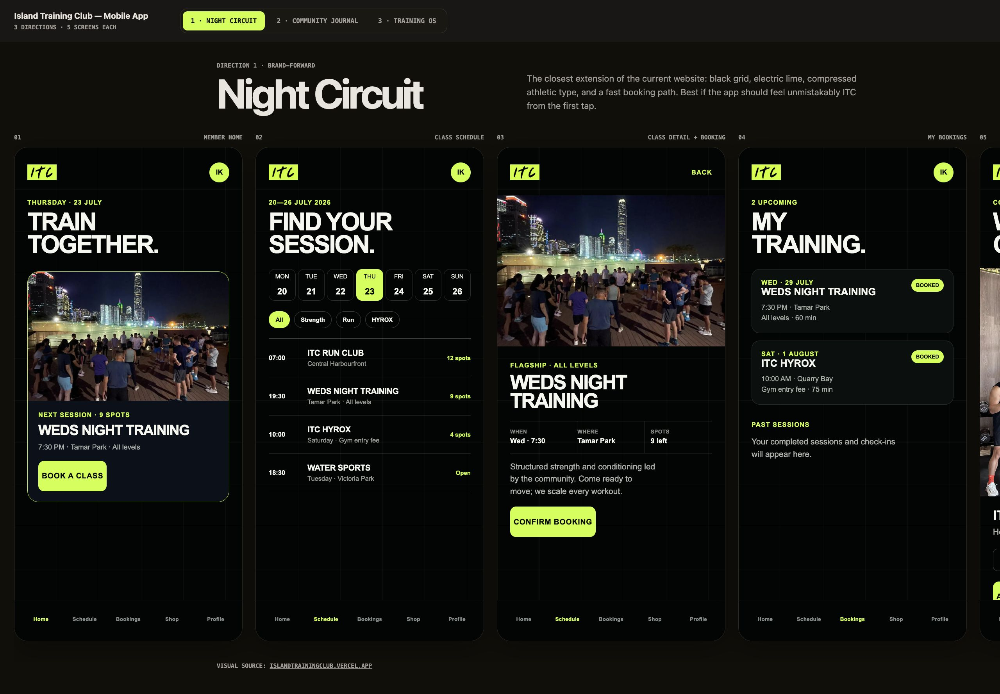

# Island Training Club Web App

This repository contains the product-discovery work, visual directions, and a working interactive prototype for a new Island Training Club community web application.

The current status is pre-production.

No production application has been built yet. The `app/` directory contains a clickable working prototype for refining flows, copy, and visuals — it is not the production implementation, and the production architecture decision remains open.

## Working Prototype

The prototype implements the selected "Night Circuit" direction and the confirmed product rules from the phase-one brief:

- Free vs paid activity classification everywhere (home, schedule, detail).
- Wednesday Night Training is free, open attendance — no booking, no capacity, no checkout. Actions are Add to Calendar (.ics download) and Get Directions.
- Weekly HYROX is paid per session at a fixed price, booked and paid in-app, with confirmation, receipt, and member-area management.
- Account lifecycle: public visitor → application → leader approval → member. Pending applicants keep public access only.
- Member area: upcoming bookings, receipts, payment history, profile.
- Admin area: applicant approval queue, activity editor (including the unresolved HYROX price/capacity as editable placeholders), member role list.
- Super Admin can additionally change member roles.

Run it (same server as the design review):

```sh
python3 -m http.server 4173
```

Open:

```text
http://127.0.0.1:4173/app/
```

The design review remains available at `http://127.0.0.1:4173/itc-mobile-design-directions.html`.

### Prototype conventions

- Zero dependencies, no build step. Plain ES modules so the codebase stays easy to refine; the production stack is still an open decision.
- Auth, payments, and the database are simulated in `localStorage`. `app/js/store.js` is the single seam where a real backend/API would later connect.
- Sign-in has no password: use a seeded email (`member@itc.hk`, `admin@itc.hk`, `owner@itc.hk`) or the one-tap demo profiles on the Account screen.
- Checkout is a test payment — any card details work, no charge occurs.
- Full loop to try: apply for membership → sign out → sign in as admin → approve in the queue → sign back in → book and pay for HYROX → see receipt in Account.
- Reset everything from Account → "Reset demo data".
- `app/smoke.mjs` is a headless regression check for the product rules (`node smoke.mjs` from `app/`).

### Deliberately not in the prototype

- Merchandise shop (deferred in the phase-one brief).
- Real payments, email receipts, notifications, and a service worker (manifest is included; a cache layer would fight the refinement loop).
- Final waiver/privacy/guidelines copy — all such text is draft placeholder.

## Selected Direction

Version 1, “Night Circuit,” is the selected visual direction.

It extends the existing Island Training Club website with a black technical grid, electric-lime accents, documentary community photography, and direct activity actions.



## Review The Designs

Run a static local server from the repository root:

```sh
python3 -m http.server 4173
```

Open:

```text
http://127.0.0.1:4173/itc-mobile-design-directions.html
```

The review includes three historical directions with five screens each.

Version 1 is the chosen starting point.

## Product Documents

- [Phase-one product brief](docs/phase-one-product-brief.md)
- [Detailed brainstorming notebook](docs/itc-web-app-product-notes.md)
- [Collaboration handoff](docs/handoff.md)

## Phase-One Summary

- Responsive, mobile-first web application.
- Architecture prepared for later iOS and Android clients.
- Public access to free activities, leaders, and culture.
- Leader approval required for full member access.
- Wednesday Night Training is free and requires no booking.
- Weekly HYROX is a paid, recurring launch activity.
- HYROX is purchased separately for each session at one fixed price.
- Paid booking and payment happen inside the application.
- Member, Admin, and Super Admin roles.

## Collaboration

The repository intentionally has no branch-protection requirement.

Authorized collaborators may push directly after they are added to the GitHub repository.

The collaborator’s GitHub username is still needed before access can be granted.
